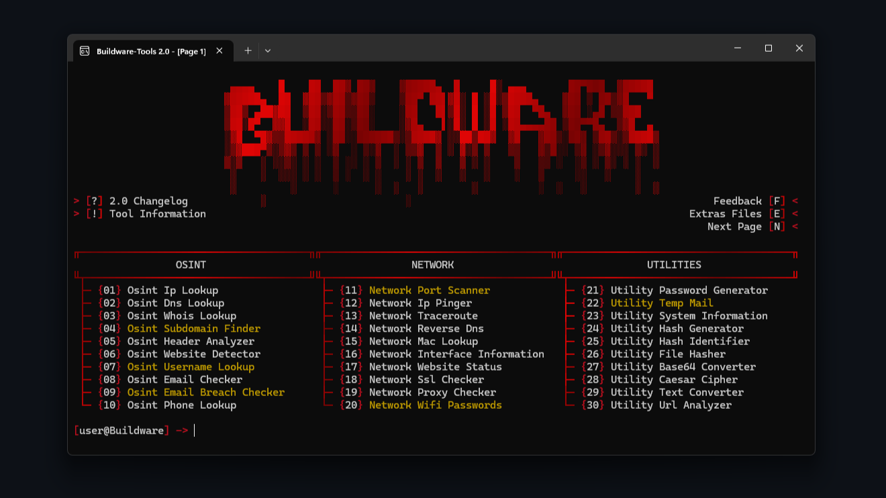
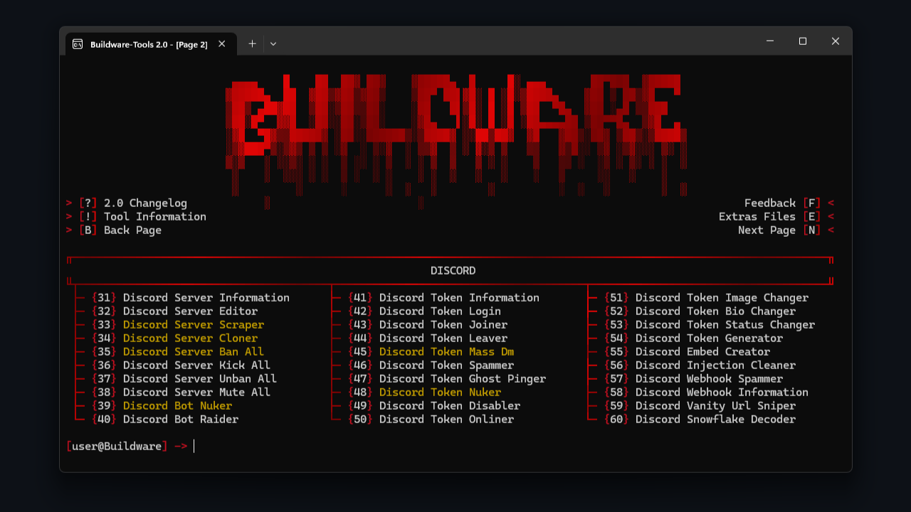
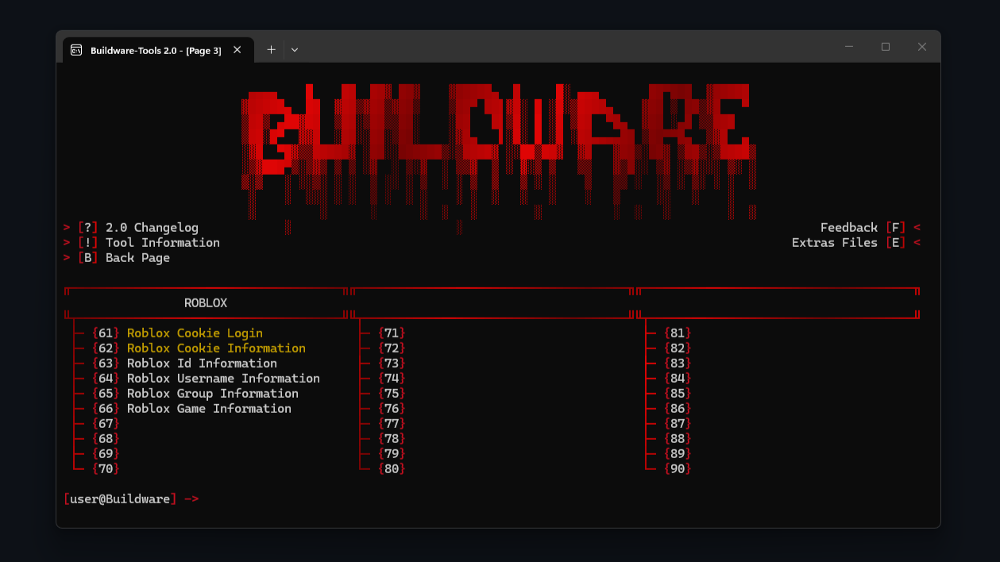
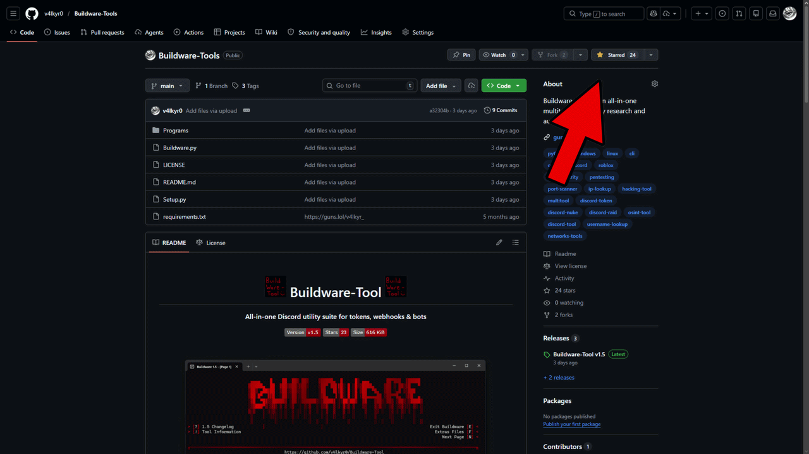

<div align="center">

# Buildware-Tools

<p>
  <strong>All-in-one multitool — Discord, OSINT, Network, Roblox & more</strong><br>
</p>

<p>


</p>

<div align="center">
  
  
</div>

<div align="center">
  
</div>

</div>

<br>

---

## 💖 Support

If you like **Buildware-Tools** and want to support the project, you can leave a star on the repository. It helps a lot and shows interest for future updates.

<div align="center">
  
</div>

<br>

---

## ⚠️ Warning

**DO NOT** download Buildware-Tools from unofficial sources. **Only use** this official GitHub repository to avoid malware, scams, or compromised versions.

<br>

---

## 📌 About

**Buildware-Tools** is a powerful multitool built by **v4lkyr0 (myself)**, designed to handle everything from **Discord automation** and **OSINT reconnaissance** to **network diagnostics**, **cryptography utilities**, and **Roblox lookups** — all from a single terminal interface. It works natively on **Windows & Linux**, requires no external setup beyond Python, and is **regularly updated** with new features and improvements.

<br>

---

## ✨ Features

> Features marked with `[⭐]` are the **most powerful** and require a **GitHub star to unlock**.

```
🛠️ Buildware-Tools
│
├── 🗺️ Navigation (6)
│   ├── Changelog                       : Displays the change history
│   ├── Feedback                        : Send feedback to the developer
│   ├── Tool Information                : Displays information about the tool
│   ├── Extras File                     : Opens Config file and Extras folder
│   ├── Next Page                       : Navigate to the next page of features
│   └── Back Page                       : Navigate to the previous page of features
│
├── 🔍 OSINT (10)
│   │
│   ├── Ip Lookup                       : Geolocates an IP address with ISP and AS details
│   ├── Dns Lookup                      : Resolves DNS records for a domain
│   ├── Whois Lookup                    : Retrieves WHOIS registration data for a domain
│   ├── Subdomain Finder                : [⭐] Discovers subdomains using certificate transparency
│   ├── Header Analyzer                 : Inspects HTTP response headers of a website
│   ├── Website Detector                : Detects technologies used by a website
│   ├── Username Lookup                 : [⭐] Searches a username across multiple platforms
│   ├── Email Checker                   : Validates an email address
│   ├── Email Breach Checker            : [⭐] Checks if an email has been in data breaches
│   └── Phone Lookup                    : Retrieves carrier and location data for a phone number
│
├── 🌐 Network (10)
│   │
│   ├── Port Scanner                    : [⭐] Scans a target for open ports and services
│   ├── Ip Pinger                       : Pings a target with detailed RTT statistics
│   ├── Traceroute                      : Traces the network route to a target
│   ├── Reverse Dns                     : Performs reverse DNS lookup on an IP address
│   ├── Mac Lookup                      : Identifies the vendor of a MAC address
│   ├── Interface Information           : Lists all network interfaces with detailed stats
│   ├── Website Status                  : Checks if a website is online and responsive
│   ├── Ssl Checker                     : Inspects SSL/TLS certificate details
│   ├── Proxy Checker                   : Tests if a proxy is working and anonymous
│   └── Wifi Passwords                  : [⭐] Retrieves saved Wi-Fi passwords from the system
│
├── 🧰 Utilities (10)
│   │
│   ├── Password Generator              : Generates secure random passwords with options
│   ├── Temp Mail                       : [⭐] Creates disposable email addresses on the fly
│   ├── System Information              : Displays detailed hardware and software info
│   ├── Hash Generator                  : Generates hashes using multiple algorithms
│   ├── Hash Identifier                 : Identifies the algorithm of an unknown hash
│   ├── File Hasher                     : Computes the hash of any local file
│   ├── Base64 Converter                : Encodes and decodes Base64 strings
│   ├── Caesar Cipher                   : Encrypts and decrypts text with Caesar shift
│   ├── Text Converter                  : Converts text between various formats
│   └── Url Analyzer                    : Analyzes URLs for headers, redirects and content
│
├── 👾 Discord (30)
│   │
│   ├── Server
│   │   ├── Server Information          : Shows detailed information about a server
│   │   ├── Server Editor               : Edits server settings and configuration
│   │   ├── Server Scraper              : [⭐] Scrapes members from a server
│   │   ├── Server Cloner               : [⭐] Clones a server's structure, channels and roles
│   │   ├── Server Ban All              : [⭐] Bans all members from a server
│   │   ├── Server Kick All             : Kicks all members from a server
│   │   ├── Server Unban All            : Unbans all banned members from a server
│   │   └── Server Mute All             : Mutes all members in a server
│   │
│   ├── Bot
│   │   ├── Bot Nuker                   : [⭐] Performs destructive actions on a server via a bot
│   │   └── Bot Raider                  : Spams messages across all channels via a bot
│   │
│   ├── Token
│   │   ├── Token Information           : Displays sensitive information about a token
│   │   ├── Token Login                 : Log in to Discord using a token via browser
│   │   ├── Token Joiner                : Makes a token join a server
│   │   ├── Token Leaver                : Makes a token leave a server
│   │   ├── Token Mass Dm               : [⭐] Sends mass private messages to all DMs
│   │   ├── Token Spammer               : Sends mass messages in a channel
│   │   ├── Token Ghost Pinger          : Sends mentions and deletes them instantly
│   │   ├── Token Nuker                 : [⭐] Performs destructive actions on the account
│   │   ├── Token Disabler              : Disables a token permanently
│   │   ├── Token Onliner               : Sets a token's status to online via gateway
│   │   ├── Token Image Changer         : Changes the account's profile picture or banner
│   │   ├── Token Bio Changer           : Changes the account's bio
│   │   ├── Token Status Changer        : Changes the custom status of the account
│   │   └── Token Generator             : Generates and checks random tokens
│   │
│   ├── Webhook
│   │   ├── Webhook Spammer             : Spams a webhook with messages
│   │   └── Webhook Information         : Shows detailed information about a webhook
│   │
│   └── Other
│       ├── Embed Creator               : Creates and sends custom Discord embeds
│       ├── Injection Cleaner           : Detects and removes Discord client injections
│       ├── Vanity Url Sniper           : Monitors and snipes custom vanity URLs
│       └── Snowflake Decoder           : Decodes any Discord snowflake ID
│
└── 🎮 Roblox (6)
    ├── Cookie Login                    : [⭐] Log in to Roblox using a cookie via browser
    ├── Cookie Information              : [⭐] Displays detailed account info from a cookie
    ├── Id Information                  : Looks up a Roblox user by their ID
    ├── Username Information            : Looks up a Roblox user by their username
    ├── Group Information               : Shows detailed information about a Roblox group
    └── Game Information                : Shows detailed information about a Roblox game
```

<br>

---

## 📦 Installation

Download the latest version [here](https://github.com/v4lkyr0/Buildware-Tools/archive/refs/heads/Buildware-Tools.zip)

```
1. Download the .zip folder.
2. Unzip the folder.
3. Run "Setup.py".
4. Enjoy!
```

**Or via Git:**

```
git clone https://github.com/v4lkyr0/Buildware-Tools.git
cd Buildware-Tools
python Setup.py
```

<br>

---

## 📋 Requirements

- **Python 3.8 or higher.**
- **Windows or Linux OS.**
- **Internet connection.**

<br>

---

## 📈 Star History

[](https://www.star-history.com/?repos=v4lkyr0%2FBuildware-Tools&type=date&legend=top-left)

---

## 💸 Donation

```yaml
- Ethereum : 0xef1d65ff652e9087ebd7af400122caebb35fdf2b
- Solana   : EqVkGSpgj2DZHN9wkKqzG9zTTiaQmMpkSuLeBynqLzbj
```

<br>

---

## ⚖️ Disclaimer

> **Buildware-Tools is strictly for educational & security research purposes.**
>
> - Use this tool **only on yourself**.
> - Any malicious or unauthorized use is **prohibited & illegal**.
> - I am **not responsible** for misuse.

---

<div align="center">
  <p>Made with <3 by <a href="https://github.com/v4lkyr0">v4lkyr0</a></p>
</div>
